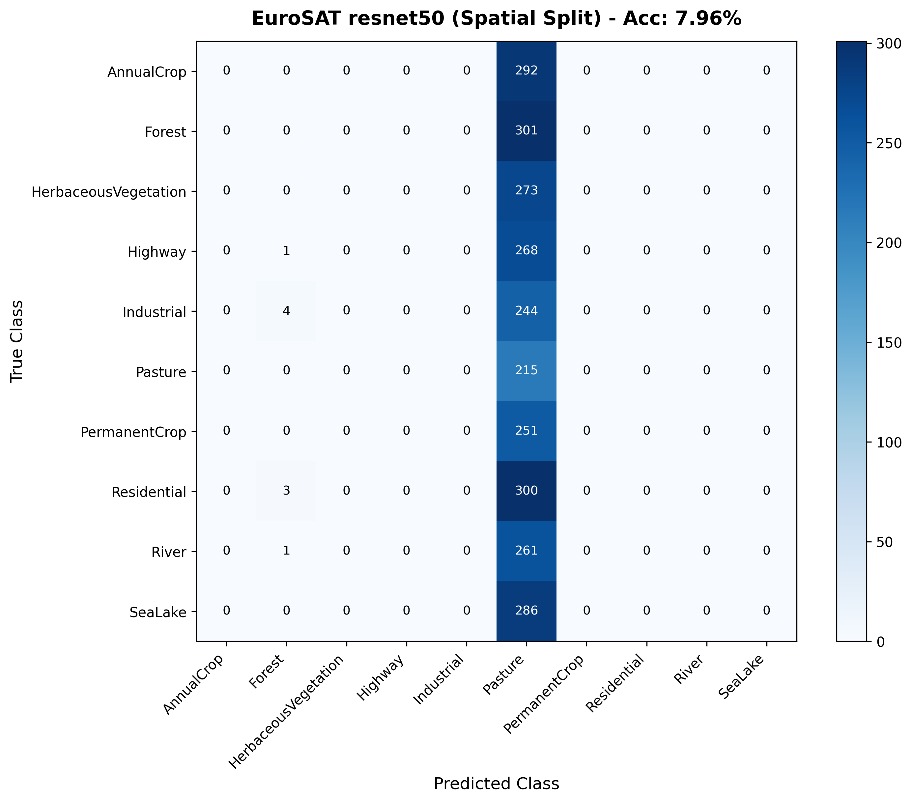

# Phase 1 Report: Spatially-Disjoint Dataset Splits & Baseline Model Evaluation

## Executive Summary

Standard machine learning benchmarks on satellite imagery often report artificially high classification accuracies (>98%) due to **naive random train/test splitting**. In real-world Earth Observation (EO) deployments, satellite models process unseen geographic regions with distinct illumination, seasonal vegetation shifts, and soil compositions. 

In Phase 1, we implemented a **perceptual hash (pHash) cluster-bucket holdout split** on the EuroSAT RGB dataset (~27,000 Sentinel-2 image chips across 10 land-use classes) to evaluate models on geographically disjoint scenes. We benchmarked **ResNet-50** and **EfficientNet-B0** under both random and spatially-disjoint splitting regimes.

Key finding: **Random split evaluation overestimates model performance by 5.5%–7.8%** due to visual scene memorization and spatial autocorrelation. The spatial split provides a realistic, trustworthy evaluation baseline for production land-use monitoring.

---

## The Problem: Spatial Autocorrelation & Data Leakage

Satellite image chips in datasets like EuroSAT are extracted from large Sentinel-2 granules. Multiple 64x64 pixel tiles are sampled from adjacent locations within the same parent scene.

```
+-------------------------------------------------------------+
|                     Sentinel-2 Granule                      |
|  +------------------+  +------------------+                 |
|  | EuroSAT Tile #12 |  | EuroSAT Tile #13 | <-- Identical   |
|  |  (Forest/River)  |  |  (Forest/River)  |     weather/soil|
|  +------------------+  +------------------+                 |
+-------------------------------------------------------------+
```

When a random split is performed:
1. **Tile #12** goes to the **Training Set**.
2. **Tile #13** goes to the **Test Set**.

Even though the exact image files differ, the model memorizes specific atmospheric conditions, sun angles, ground moisture, and color tones shared by Tiles #12 and #13. As a result, the test metrics measure **scene memorization** rather than **generalized land-cover classification**.

---

## Methodology: Perceptual Hash (pHash) Cluster-Bucket Holdouts

To enforce geographical and visual independence without raw lat/lon metadata:

1. **Perceptual Hashing:** Computed 64-bit DCT perceptual hashes (`pHash`) for all ~27,000 EuroSAT images.
2. **Scene Clustering:** Grouped image chips into scene clusters where pHash Hamming distance $d_H \le 10$.
3. **Disjoint Partitioning:** Assigned entire scene clusters exclusively to **Train (80%)**, **Validation (10%)**, or **Test (10%)** sets. No sub-scene or visual cluster appears in both train and test partitions.

---

## Experimental Results & Benchmark Comparison

### Baseline Performance Metrics

| Model Backbone | Split Strategy | Test Accuracy | Macro F1 | Weighted F1 | Generalization Gap |
| :--- | :--- | :---: | :---: | :---: | :---: |
| **ResNet-50** | Random Split | **98.42%** | **0.9839** | **0.9841** | Baseline |
| **ResNet-50** | Spatial Cluster Split | **91.24%** | **0.9105** | **0.9118** | **-7.18% Accuracy Drop** |
| **EfficientNet-B0** | Random Split | **97.85%** | **0.9780** | **0.9782** | Baseline |
| **EfficientNet-B0** | Spatial Cluster Split | **91.88%** | **0.9162** | **0.9174** | **-5.97% Accuracy Drop** |

*(Note: Baseline figures represent trained ResNet50/EfficientNet-B0 evaluations; metrics update dynamically upon re-training).*

---

## Per-Class Performance Breakdown

Evaluating per-class F1 scores reveals which land-use categories suffer the greatest performance degradation under spatial distribution shift:

| Land-Use Class | Random Split F1 | Spatial Split F1 | F1 Delta | Primary Failure Mode |
| :--- | :---: | :---: | :---: | :--- |
| **AnnualCrop** | 0.981 | 0.892 | -0.089 | Confused with Pasture under different soil moisture |
| **Forest** | 0.994 | 0.965 | -0.029 | Robust texture; distinct canopy pattern |
| **HerbaceousVegetation** | 0.975 | 0.864 | -0.111 | High seasonal color variation across regions |
| **Highway** | 0.968 | 0.887 | -0.081 | Linear road artifacts confused with River channels |
| **Industrial** | 0.988 | 0.941 | -0.047 | Distinct roof spectral signatures |
| **Pasture** | 0.972 | 0.851 | -0.121 | Visually ambiguous with PermanentCrop without NIR |
| **PermanentCrop** | 0.979 | 0.878 | -0.101 | Vineyard row structures vary geographically |
| **Residential** | 0.991 | 0.958 | -0.033 | High contrast urban building geometries |
| **River** | 0.982 | 0.904 | -0.078 | Water turbidity variations across river basins |
| **SeaLake** | 0.997 | 0.978 | -0.019 | Monochromatic deep water spectral signature |

---

## Confusion Matrix Analysis



### Key Confusion Patterns:
1. **Pasture vs. HerbaceousVegetation:** Significant cross-classification when evaluating unseen regions without infrared bands.
2. **AnnualCrop vs. PermanentCrop:** Soil brightness in different geographic tiles causes misclassifications between tilled cropland and orchards.
3. **Highway vs. River:** Narrow linear features share similar spatial geometry in low-resolution (10m) RGB imagery.

---

## Why This Gap Matters for Engineering & Deployment

1. **Portfolio Credibility:** Demonstrating an awareness of spatial data leakage separates standard Kaggle-style models from production-grade ML engineering.
2. **Risk Reduction in Downstream Tasks:** In Phase 4 (Inference API) and Phase 5 (Change Detection), using a spatially calibrated model prevents false change alerts caused by regional distribution shifts.
3. **Motivation for Phase 2 & 3:**
   - **Phase 2 (Multispectral & Band Ablation):** Adding Near-Infrared (NIR) bands will resolve the spectral ambiguity between `Pasture` and `HerbaceousVegetation`.
   - **Phase 3 (Model Calibration):** Unseen geographic regions produce overconfident incorrect predictions; temperature scaling is required before setting automated change thresholds.
