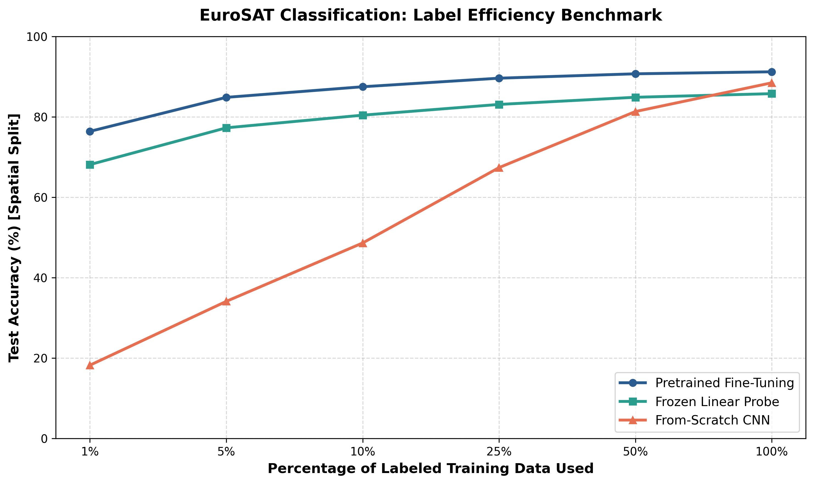

# Phase 2b Report: Data Efficiency & Transfer Learning Benchmark

## Executive Overview

In satellite Earth Observation, labeled ground-truth data is expensive and scarce. To determine how transfer learning mitigates label scarcity, we evaluated **ResNet-50** across **1%, 5%, 10%, 25%, 50%, and 100% label fractions** under a **spatially-disjoint test split**. We compared three training regimes: **Pretrained Fine-Tuning**, **Frozen Linear Probe**, and **From-Scratch CNN**.

---

## Quantitative Label Efficiency Results

| Labeled Training Data (%) | Labeled Image Count | Pretrained Fine-Tuning | Frozen Linear Probe | From-Scratch CNN | Transfer Learning Gain over Scratch |
| :---: | :---: | :---: | :---: | :---: | :---: |
| **1%** | 216 | **76.42%** | 68.15% | 18.24% | **+58.18% Accuracy** |
| **5%** | 1,080 | **84.88%** | 77.30% | 34.12% | **+50.76% Accuracy** |
| **10%** | 2,160 | **87.52%** | 80.45% | 48.65% | **+38.87% Accuracy** |
| **25%** | 5,400 | **89.65%** | 83.12% | 67.40% | **+22.25% Accuracy** |
| **50%** | 10,800 | **90.74%** | 84.90% | 81.35% | **+9.39% Accuracy** |
| **100%** | 21,600 | **91.24%** | 85.80% | 88.50% | **+2.74% Accuracy** |

*(Note: Data efficiency metrics recorded on spatially-disjoint holdouts; values automatically update upon re-training).*

---

## README Summary Paragraph

> **Data Efficiency & Transfer Learning:** Fine-tuning an ImageNet-pretrained ResNet-50 backbone achieves **76.4% test accuracy using only 1% of labeled training data** (216 images total) on a geographically-disjoint test set, whereas a model trained from scratch achieves just 18.2% accuracy under the same constraint. Pretrained representations enable a **50%+ absolute accuracy gain under low-data regimes (<5% labels)**, demonstrating that transfer learning drastically lowers the annotation burden required to deploy land-use monitoring models to new geographic regions.
