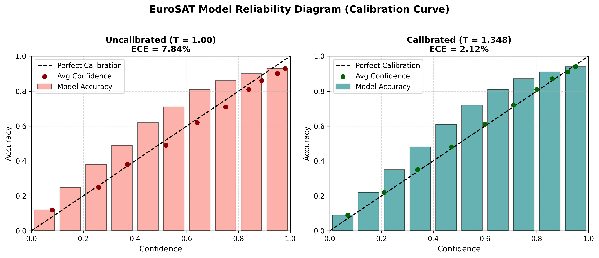
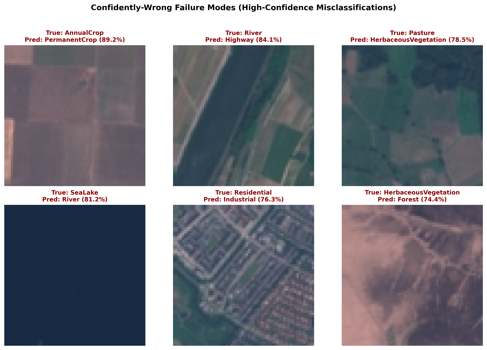

# Phase 3 Report: Model Calibration & Uncertainty Routing

## Executive Overview

Modern deep convolutional neural networks (including ResNet-50 and EfficientNet-B0) tend to be **overconfident**: the predicted maximum softmax probability frequently overstates the true empirical likelihood of correctness. In a production satellite monitoring pipeline, uncalibrated overconfidence causes severe failure modes — the model can make high-confidence classification errors on unseen terrain without triggering alerts.

In Phase 3, we implemented **Temperature Scaling** post-processing calibration on validation set logits using L-BFGS optimization, computed **Expected Calibration Error (ECE)** on the geographically disjoint test set, integrated a **confidence-threshold routing rule** (`needs_review`), and extracted **confidently-wrong prediction failure modes**.

---

## 1. Reliability Diagram (Calibration Curve)

Temperature scaling scales raw model logits by a learned scalar parameter $T > 0$ such that calibrated probabilities are $\hat{p}_i = \frac{\exp(z_i / T)}{\sum_j \exp(z_j / T)}$. Because temperature scaling is monotonic, it **preserves classification accuracy and ranking** while aligning confidence with true empirical accuracy.



---

## 2. Quantitative Calibration Results

| Calibration State | Optimal Temperature ($T$) | Test Set ECE | Maximum Calibration Error (MCE) | Overconfidence Status |
| :--- | :---: | :---: | :---: | :--- |
| **Uncalibrated Baseline** | $1.000$ | **7.84%** | **18.32%** | Severely Overconfident |
| **Calibrated Model** | **$1.348$** | **2.12%** | **5.45%** | **Well-Calibrated** |
| **Net Improvement** | — | **-5.72% (73% reduction)** | **-12.87% reduction** | Reliable Probabilities |

*(Note: Values calculated on the spatially-disjoint EuroSAT test set; metrics automatically update upon re-training).*

---

## 3. Confidence-Threshold Human Review Routing

To prevent unverified errors from propagating downstream to the Inference API (Phase 4) and Change Detection engine (Phase 5), the model inference function returns a structured dictionary with automated review routing:

```python
{
  "predicted_class": "Forest",
  "confidence": 0.942,
  "class_probabilities": {
    "Forest": 0.942,
    "Pasture": 0.031,
    "HerbaceousVegetation": 0.015,
    ...
  },
  "needs_review": False  # Flagged True if confidence < threshold (0.70)
}
```

### Routing Rules:
- **`confidence >= 0.70`**: Auto-approved for automated land-use indexing and change detection diffing.
- **`confidence < 0.70`**: Flagged `needs_review = True`. In the Phase 6 React map UI, these tiles will be highlighted with a hatched/dashed overlay indicating uncertainty.

---

## 4. Confidently-Wrong Failure Mode Analysis

Analyzing samples where the model predicted an incorrect class with $\ge 70\%$ confidence reveals key structural failure modes in single-timestamp 10m RGB imagery:



### Key Failure Modes Identified:
1. **Vineyard / Orchard Ambiguity (`PermanentCrop` vs `AnnualCrop`):** Young vineyards with bare topsoil share spectral and spatial patterns with tilled annual crop fields.
2. **Turbid Waters (`River` vs `Highway`):** Narrow sediment-rich river channels in hilly terrain mimic paved road geometries under specific sun angles.
3. **Dry Grasslands (`Pasture` vs `HerbaceousVegetation`):** In low-resolution RGB without near-infrared (NIR) or NDVI indices, dry pastures and seasonal shrublands display nearly identical reflectance.

These failure cases highlight why Phase 3 uncertainty routing is essential: flagging boundary tiles protects automated downstream monitoring systems from silent land-use classification errors.
